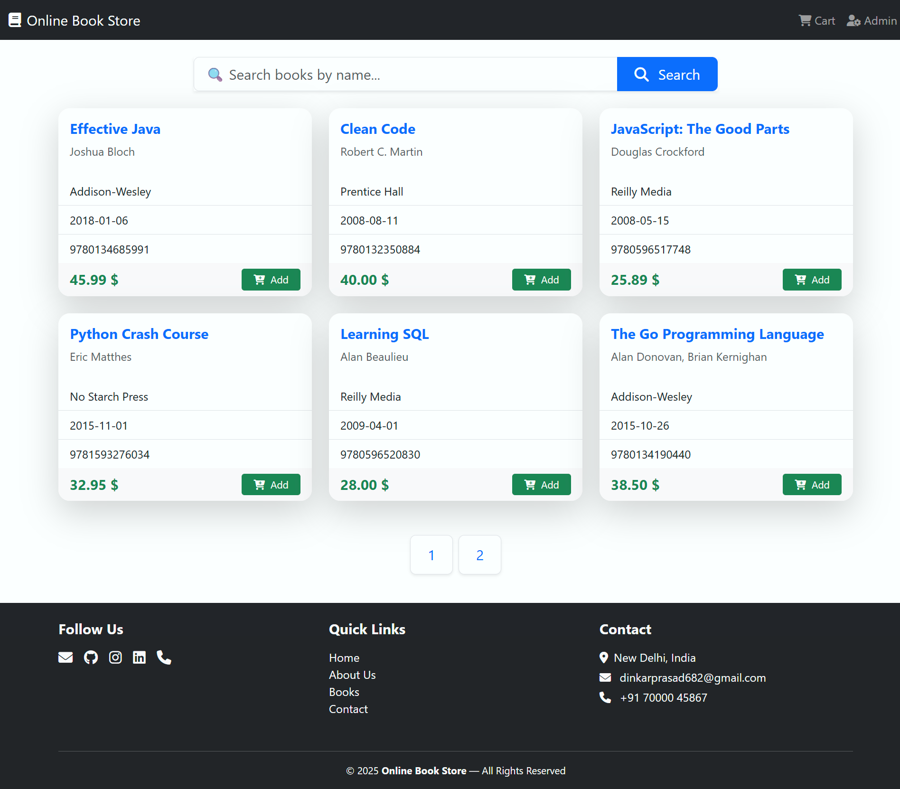
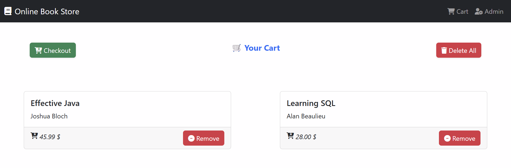
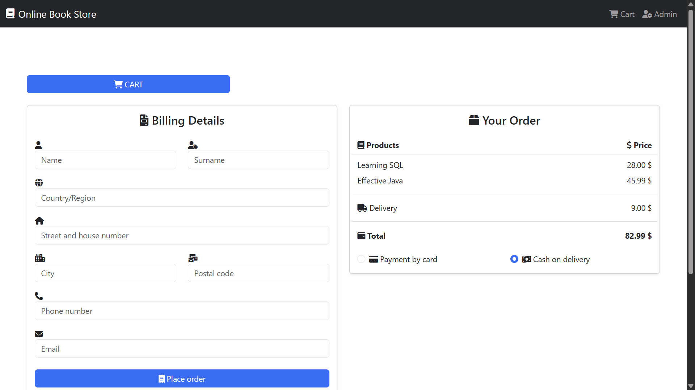
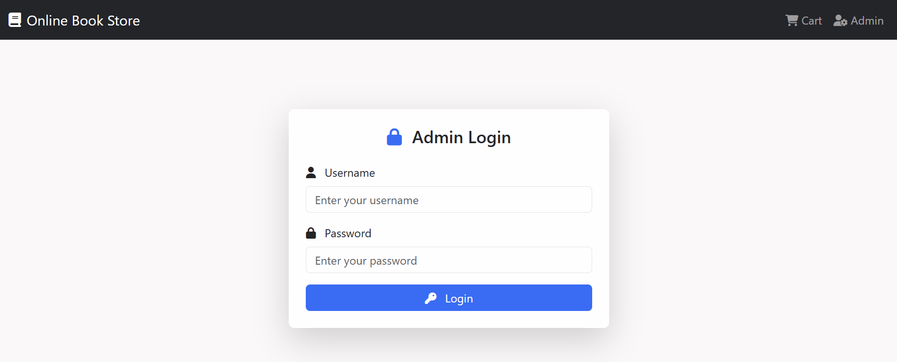
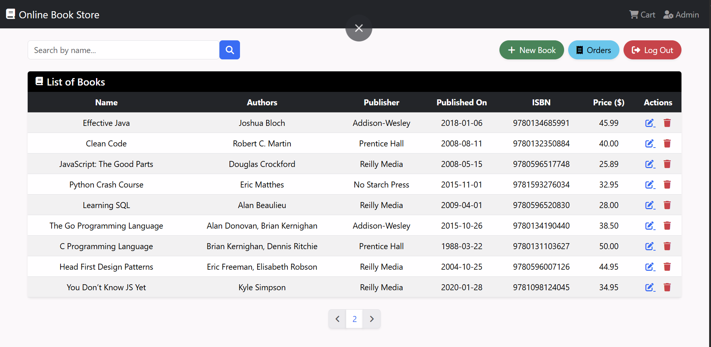
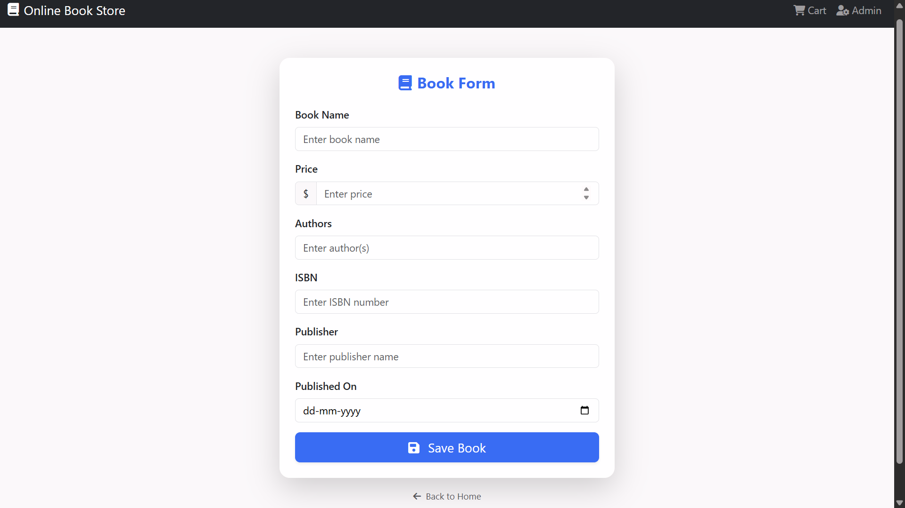
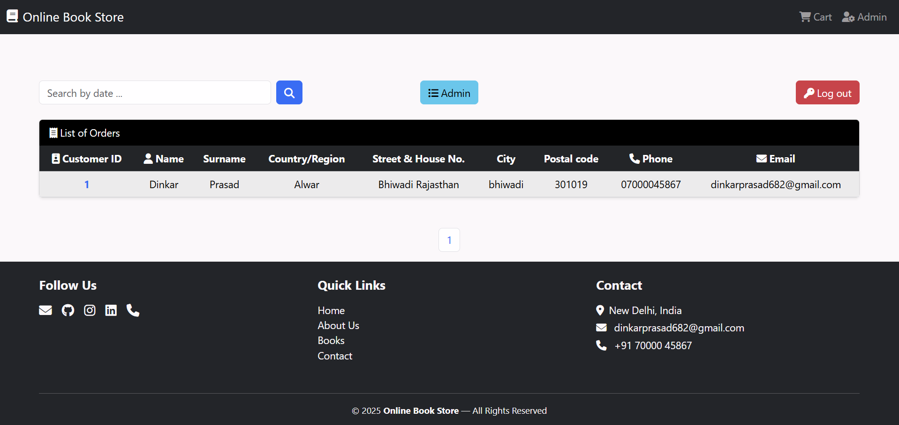

# 📚 Online Bookstore                           
                           
A **user-friendly online bookstore** where users can register or log in, browse available books, choose desired quantities, and purchase them securely. The platform also provides a payment receipt after successful transactions.  
Administrators can manage the store's inventory, including adding, removing, and updating book details, as well as maintaining sales history.

---            
           
## 📖 About    
This project is designed to:      
- 📚 Sell books online.  
- 🧾 Maintain a history of book sales.  
- ➕ Add and manage books efficiently.  
- 😀 Provide a **user-friendly** interface for customers and administrators.  
- ⚙️ Demonstrate the implementation of **Java Http Servlets** with JDBC.  

---    

## 🛠 Features

### **👨‍💼 Admin Features**
- ➕ Add new books.   
- 📋 View available books.  
- ❌ Remove books from the store.  
- 📈 Increase or 📉 decrease book quantities.  
- 💰 Update book prices.  
- 🧾 Maintain sales history.  

- ✅ Data validation using Hibernate Validator  
- 🔐 Basic security with Spring Security  
- 📧 Email support with Spring Mail  
- 🗄️ MySQL integration using Hibernate ORM  
- ⚡ Hot reload with Spring Boot DevTools  
- 🧪 Unit and integration testing with Spring Boot Test  

---

## 🧰 Technologies Used
- 🖥️ **Backend:** Java, Spring Boot, Spring MVC, Spring Security, Hibernate (JPA)  
- 🎨 **Frontend:** Thymeleaf, HTML, CSS, Bootstrap  
- 🗄️ **Database:** MySQL, H2 (for testing)  
- 🔌 **Connection Pooling:** C3P0  
- ✅ **Validation:** Hibernate Validator, JSR-303  
- 📧 **Email:** Spring Boot Mail Starter     
- ⚒️ **Build Tool:** Maven  

---

### **👥 User Features**
- 🔑 Admin login.  
- 👤 Log in with existing credentials.  
- 📚 View all available books.  
- 🛒 Select books and quantity for purchase.  
- 💳 Buy books securely.  
- 🧾 Receive a payment receipt after successful purchase.  

    
---
  
## 🚀 Getting Started

## 📸 Screenshot
 Home Page:

cart :

by  Books :

Admin Login :

Books Data :

add  Books :

order  details :

---

  
    
## 🔗 Connect with me

 💼 [LinkedIn](https://www.linkedin.com/in/dinkarprasadjava)  |  🐙 [GitHub](https://github.com/DK12345678D) | 📧 [Gmail](mailto:dinkarprasad682@gmail.com) 
 
 ---

